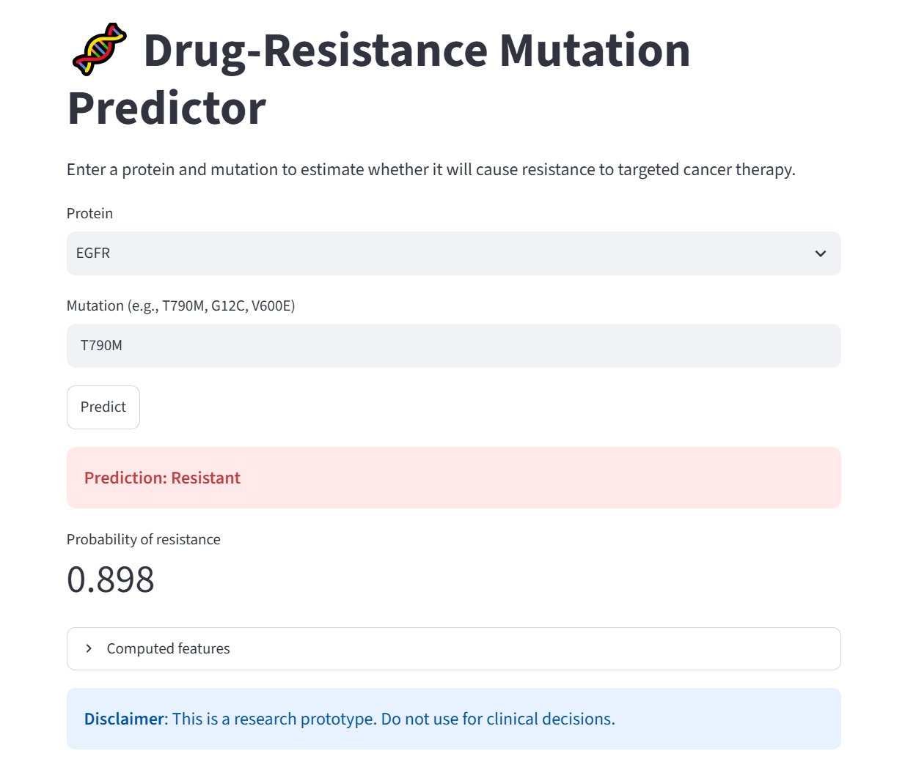
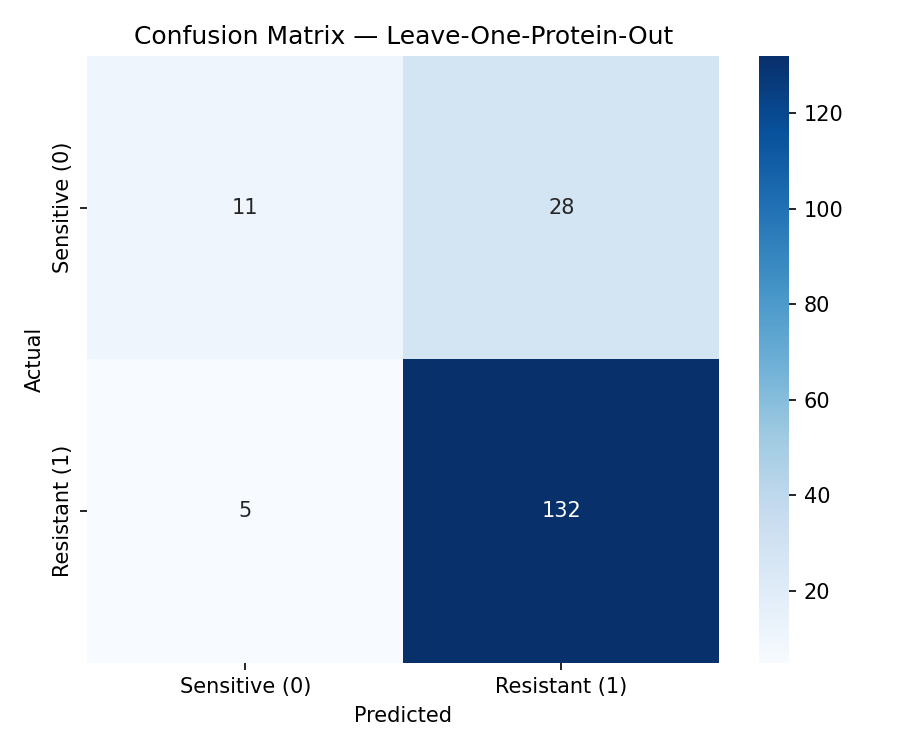
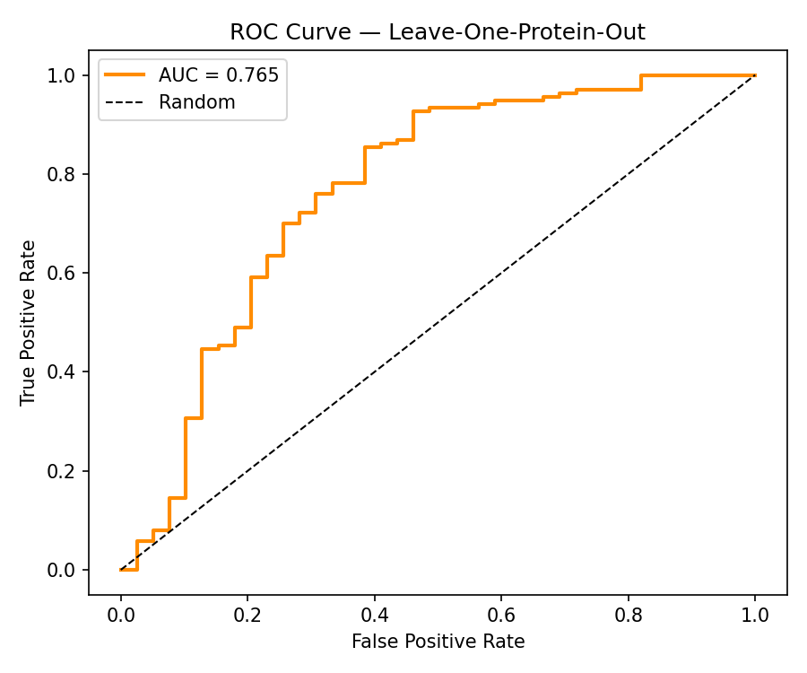
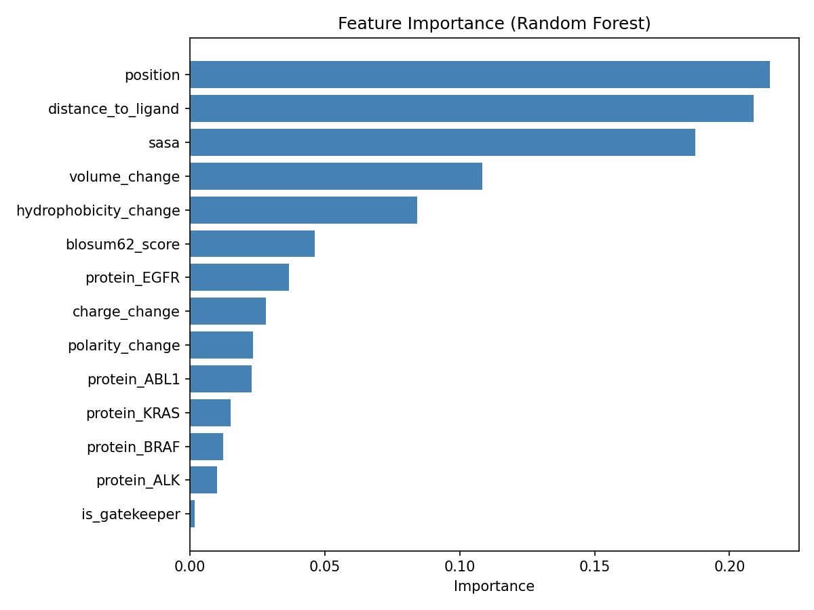
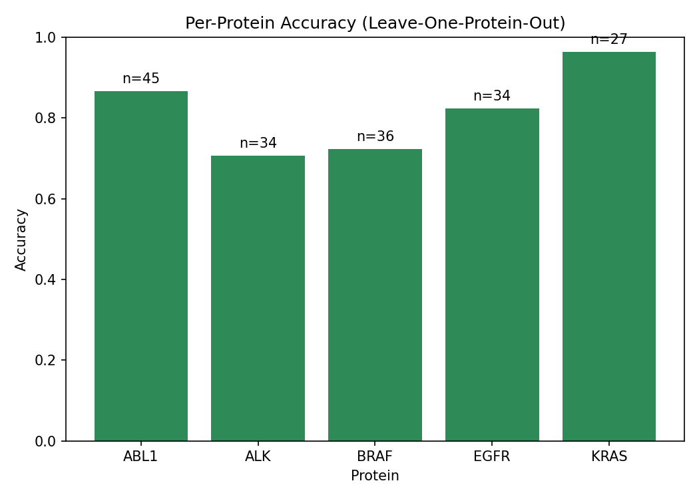

# Drug-Resistance Mutation Prediction Pipeline

A machine learning pipeline that predicts whether a cancer mutation will cause resistance to targeted therapy.

**Author**: Noor Manahil · [GitHub](https://github.com/noor-chemoinformatics)

---

## Overview

Cancer cells acquire mutations that stop targeted therapies from working. This project builds a predictive model that flags likely-resistant mutations before they cause clinical relapse.

The pipeline integrates:

- **cBioPortal** (TCGA cancer mutation data)
- **Curated clinical literature** (resistance mutation annotations)
- **PDB** protein structures (via Biopython)
- **Machine learning** (Random Forest with Leave-One-Protein-Out CV)

---

## Results

| Metric | Value |
|--------|-------|
| Accuracy | 81.2% |
| AUC | 0.765 |
| Sensitivity (resistant recall) | 96.4% |
| Specificity (sensitive recall) | 28.2% |
| Training mutations | 176 |
| Proteins | EGFR, ABL1, ALK, KRAS, BRAF |

**Key finding:** The model achieves high sensitivity (catches 96% of resistant mutations), which is the safer error profile in cancer therapy. Specificity is lower due to class imbalance in the training data.

---

## Demo

Try it yourself:

    streamlit run app/streamlit_app.py

Then open http://localhost:8501 in your browser.

Example predictions:

| Protein | Mutation | Prediction | Probability |
|---------|----------|------------|-------------|
| EGFR | T790M | Resistant | 0.90 |
| EGFR | L858R | Sensitive | - |
| ABL1 | T315I | Resistant | - |
| KRAS | G12C | Sensitive | - |

---

## Installation

    git clone https://github.com/noor-chemoinformatics/resistance-mutation-pipeline.git
    cd resistance-mutation-pipeline

    conda create -n resist python=3.10 -y
    conda activate resist
    pip install -r requirements.txt

---

## Usage

Run the pipeline step by step:

    python -m src.data.collect_cbioportal
    python -m src.data.curate_dataset
    python -m src.data.download_structures
    python -m src.features.build_features
    python -m src.models.train
    python -m src.models.visualize
    streamlit run app/streamlit_app.py

---

## Project Structure

    resistance-mutation-pipeline/
    ├── README.md
    ├── LICENSE
    ├── requirements.txt
    ├── .gitignore
    ├── app/
    │   └── streamlit_app.py
    ├── data/
    │   ├── raw/
    │   ├── processed/
    │   │   ├── curated_mutations.csv
    │   │   └── features.csv
    │   └── structures/
    ├── src/
    │   ├── data/
    │   │   ├── collect_cbioportal.py
    │   │   ├── curate_dataset.py
    │   │   └── download_structures.py
    │   ├── features/
    │   │   ├── parse_mutations.py
    │   │   └── build_features.py
    │   └── models/
    │       ├── train.py
    │       └── visualize.py
    ├── results/
    │   ├── model.pkl
    │   ├── predictions.csv
    │   ├── evaluation_report.md
    │   └── figures/
    │       ├── confusion_matrix.png
    │       ├── roc_curve.png
    │       ├── feature_importance.png
    │       ├── per_protein_accuracy.png
    │       └── demo_screenshot.png
    └── tests/

---

## Method

### Features (14 total)

| Category | Features |
|----------|----------|
| Structural | SASA, distance to ligand, residue position, gatekeeper flag |
| Chemistry | Hydrophobicity change, volume change, charge change, polarity change, BLOSUM62 score |
| Protein | One-hot encoding per protein (5) |

### Model

- **Classifier**: Random Forest (300 trees, max_depth=6, class_weight='balanced')
- **Validation**: Leave-One-Protein-Out cross-validation
- **Why this validation**: Tests cross-target generalization -- the model must predict on a protein it has never seen

### Feature Importance

Top 5 features driving predictions:

1. **Position** (0.215)
2. **Distance to ligand** (0.209)
3. **SASA** (0.187)
4. **Volume change** (0.108)
5. **Hydrophobicity change** (0.084)

---
## Model Evaluation

### Confusion Matrix

The model catches 96% of resistant mutations (132 of 137) but mislabels 28 sensitive mutations as resistant. This is the expected trade-off on an imbalanced dataset — the safer error profile in cancer therapy.

### ROC Curve

AUC = 0.765. The model performs well above random (0.5), showing real predictive signal.

### Feature Importance

The top features driving predictions are `position`, `distance_to_ligand`, and `SASA` — all structural signals. Chemistry-change features (volume, hydrophobicity) contribute next, confirming that both geometry and amino acid properties matter.

### Per-Protein Accuracy

Performance varies by protein. This is expected in leave-one-protein-out validation — the model must predict on a protein it never trained on.
## Limitations

1. **Small dataset**: 176 mutations across 5 proteins
2. **Class imbalance**: 141 resistant vs 47 sensitive
3. **Low specificity (0.28)**: The model defaults to the majority class
4. **Label noise**: Resistance labels come from literature with varying evidence levels
5. **Structural coverage**: 12 mutations lacked residues in PDB structures

---

## Future Work

- Add more sensitive mutations to balance classes
- Apply SMOTE synthetic oversampling
- Try XGBoost and compare AUC
- Add conservation scores (phyloP, GERP) as features
- Use AlphaFold2 structures for mutations outside PDB coverage
- Extend to more therapeutic targets

---

## Skills Demonstrated

- **Bioinformatics**: cBioPortal API, PDB structure parsing, Biopython
- **Protein modeling**: SASA calculation, ligand distance, amino acid chemistry
- **Machine learning**: Random Forest, cross-validation, class imbalance handling
- **Software engineering**: modular code, Git workflow, virtual environments
- **Deployment**: Streamlit interactive app
- **Scientific writing**: evaluation report, documentation

---

## License

MIT License. See LICENSE file.

---

## References

- cBioPortal: https://www.cbioportal.org
- PDB: https://www.rcsb.org
- MdrDB: https://mdrdb.idrblab.net
- COSMIC: https://cancer.sanger.ac.uk/cosmic# resistance-mutation-pipeline
